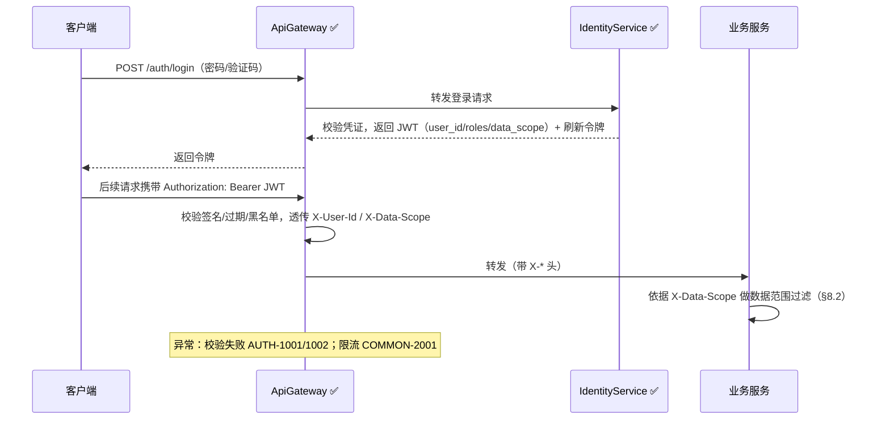
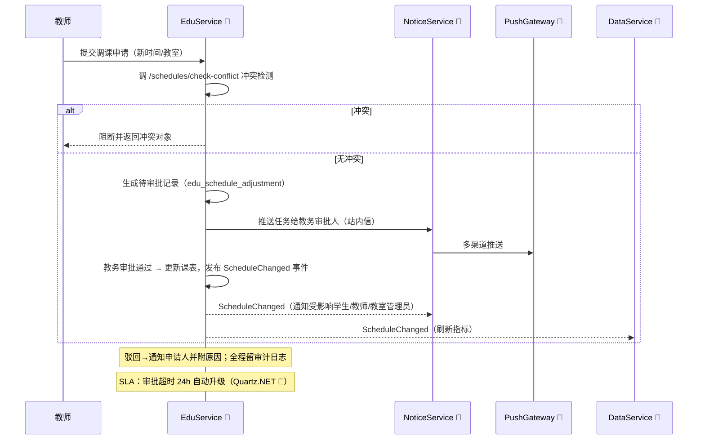
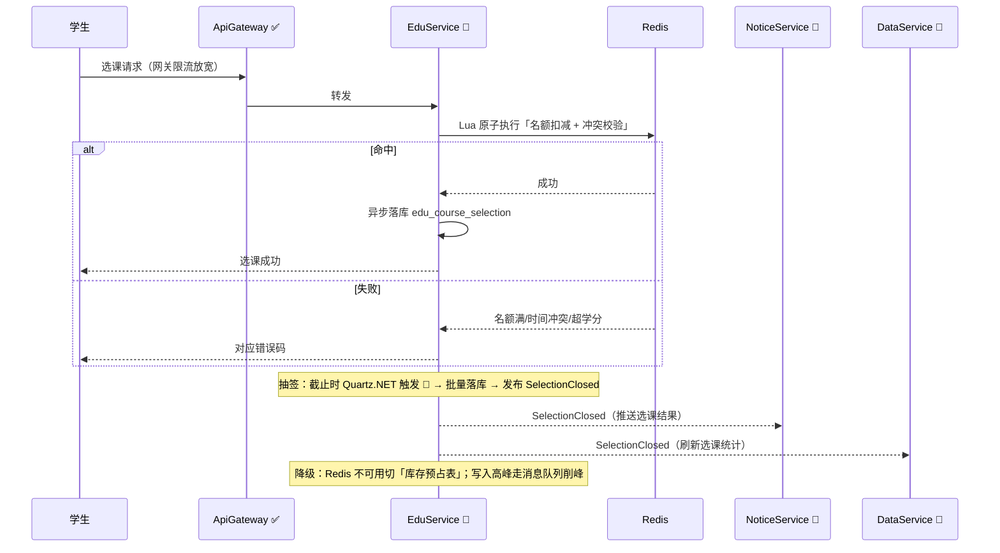
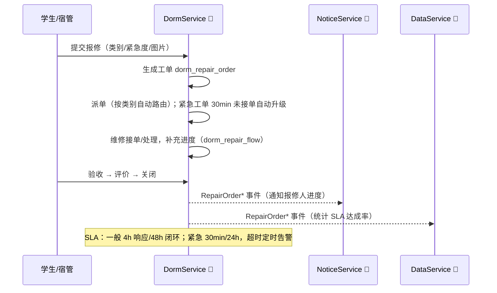
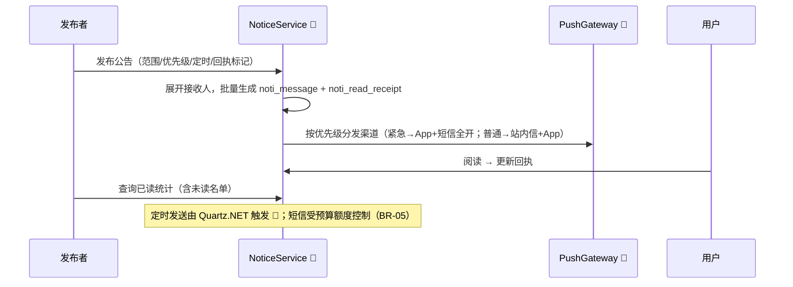
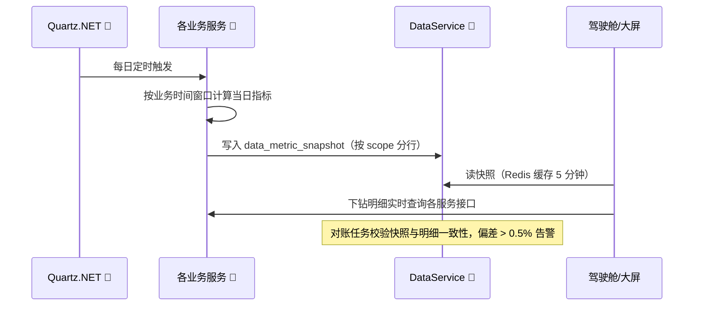

# SmartCampusOS 智慧校园管理系统 — 详细设计文档（LLD）

## 文档信息

| 项目 | 内容 |
| --- | --- |
| 文档名称 | SmartCampusOS 智慧校园管理系统 详细设计文档 |
| 版本号 | v1.1 |
| 文档状态 | 已评审（实施中，v1.1 为现状对齐修订） |
| 编写日期 | 2026-08-06 |
| 编写人 | 架构组 / 研发组 |
| 关联文档 | SmartCampusOS-智慧校园管理系统-PRD v1.0 |
| 适用对象 | 研发、测试、运维、架构评审 |

**修订记录**

| 版本 | 日期 | 修订人 | 修订说明 |
| --- | --- | --- | --- |
| v0.1 | 2026-08-01 | 架构组 | 架构与服务划分初稿 |
| v1.0 | 2026-08-06 | 架构组 | 全量详细设计定稿，待评审 |
| v1.1 | 2026-08-06 | 架构组 | 现状对齐：标注各模块实现状态（✅ 已实现 / 🚧 规划中 / ➡️ 目标架构）；修正 ContractTests 为 FunctionalTests（Reqnroll）；统一响应码为字符串语义；接口 JSON 契约改为以各服务 Swagger/OpenAPI 为准 |

---

## 目录

- [1. 引言](#1-引言)
- [2. 总体架构](#2-总体架构)
  - 2.1 架构原则
  - 2.2 逻辑架构视图
  - 2.3 服务划分总览
  - 2.4 技术选型
  - 2.5 服务间通信约定
  - 2.6 后端代码层级架构
  - 2.7 前端代码层级架构
- [3. 服务详细设计](#3-服务详细设计)
  - [3.1 ApiGateway](#31-apigateway) · [3.2 IdentityService](#32-identityservice认证授权) · [3.3 EduService](#33-eduservice教务) · [3.4 DormService](#34-dormservice宿舍后勤)
  - [3.5 NoticeService](#35-noticeservice通知家校) · [3.6 DataService](#36-dataservice数据可视化) · [3.7 PushGateway](#37-pushgateway推送网关) · [3.8 FileService](#38-fileservice文件服务)
- [4. 数据库设计](#4-数据库设计)
- [5. 接口设计（概念级）](#5-接口设计概念级)
- [6. 关键流程设计（时序）](#6-关键流程设计时序)
- [7. 领域事件设计](#7-领域事件设计)
- [8. 权限与安全设计](#8-权限与安全设计)
- [9. 缓存与性能设计](#9-缓存与性能设计)
- [10. 部署与运维](#10-部署与运维)
- [11. 错误码约定](#11-错误码约定)
- [12. 测试策略要点](#12-测试策略要点)
- [13. 附录](#13-附录)

---

## 1. 引言

### 1.1 目的

本文档基于 PRD v1.0，对 SmartCampusOS 的系统架构、服务划分、数据模型、接口、关键流程、安全与部署进行详细设计说明，作为研发、测试与运维的实施依据。本文档为**概念级设计**：给出服务划分、接口清单与说明，不包含完整 DDL 与 JSON 示例（数据表与 ER 结构见《数据库设计文档》）。

> **实现状态图例**：✅ = 已按本文档落地；🚧 = 规划中（接口已设计、网关路由已预留，但服务代码尚未实现）；➡️ = 目标架构（依赖外部环境，尚未落地）。v1.1 起随实现进度持续更新。

### 1.2 设计范围

对应 PRD v1.0 全部功能域：教务管理（Edu-01~06）、宿舍与后勤（Dorm-01~06）、通知与家校互动（Noti-01~05）、数据可视化（Data-01~04）、通用平台（Common-01~06），并预留考勤门禁、一卡通消费扩展接口。

### 1.3 设计目标

1. **可演进**：模块化微服务，先按本设计落地，可按规模合并或拆分。
2. **可追溯**：表、接口、事件均关联 PRD 需求编号。
3. **可观测**：全链路日志、指标、追踪默认开启。
4. **合规**：未成年人数据最小化采集与脱敏在架构层面落实。

### 1.4 术语与约定

- 需求编号（Edu-/Dorm-/Noti-/Data-/Common-/BR-）沿用 PRD v1.0。
- 全局标识：所有跨服务引用的实体使用 `long` 型雪花 ID（`SnowflakeId`）。
- 时间：统一存储 UTC，展示层转东八区；接口参数一律 `yyyy-MM-dd HH:mm:ss`。

---

## 2. 总体架构

### 2.1 架构原则

1. **微服务 + 事件驱动**：按领域边界拆分服务，服务间同步调用走 REST，异步联动走领域事件（MassTransit + RabbitMQ）。
2. **数据库按服务隔离**：每个服务独立数据库，禁止跨库 JOIN，跨服务数据通过接口或事件同步。
3. **网关统一入口**：所有客户端经 API 网关鉴权、限流、路由，服务不对外暴露。
4. **多端一套 API**：Web / App / 小程序 / 大屏共用 REST API；实时类场景走 SignalR。

### 2.2 逻辑架构视图

```mermaid
flowchart TB
    subgraph 客户端
        A1[Web 管理端 ✅] --- A2[App / 小程序 🚧] --- A3[数据大屏 🚧]
    end
    A1 & A2 & A3 -- HTTPS --> B[API 网关 YARP ✅<br/>路由 / JWT 校验 / 限流 / 灰度 / 审计入口]
    B --> C1[IdentityService ✅ 认证授权]
    B --> C2[EduService 🚧 教务]
    B --> C3[DormService 🚧 宿舍后勤]
    B --> C4[NoticeService 🚧 通知家校]
    B --> C5[DataService 🚧 数据可视化]
    B --> C6[PushGateway 🚧 推送]
    B --> C7[FileService 🚧 文件]
    C1 & C2 & C3 & C4 & C5 & C6 & C7 --> D[基础设施]<br/>MySQL 每服务一库 / Redis / RabbitMQ 事件总线<br/>OpenTelemetry ✅ / 对象存储 MinIO-OSS 🚧 / SignalR 🚧
```

### 2.3 服务划分总览

| 服务 | 职责 | 独立数据库 | 对应需求 | 实现状态 |
| --- | --- | --- | --- | :-: |
| ApiGateway | 统一入口：路由、JWT 校验、限流、灰度 | 无（无状态） | Common | ✅ |
| IdentityService | 账号、认证、组织架构、RBAC、数据字典、审计日志、家长绑定 | identity_db | Common-01~04 | ✅ |
| EduService | 学期、课表、选课、成绩、考试、学籍 | edu_db | Edu-01~06 | 🚧 |
| DormService | 宿舍床位、报修、场地预约、设施巡检 | dorm_db | Dorm-01~06 | 🚧 |
| NoticeService | 公告通知、消息中心、已读回执、家校互动 | notice_db | Noti-01~05 | 🚧 |
| DataService | 指标快照、驾驶舱、数据大屏、报表中心 | data_db | Data-01~04 | 🚧 |
| PushGateway | 统一推送网关：站内信 / App 推送 / 短信 / 微信 | push_db | Common-06 | 🚧 |
| FileService | 附件上传、下载、签名 URL、防盗链 | file_db | 通用 | 🚧 |

> **落地说明（v1.1）**：除 ApiGateway / IdentityService 外，其余 6 个服务当前仅完成项目脚手架（Api 占位 + Aspire 编排引用），Application / Domain / Infrastructure 层与业务接口尚未实现（见 §3 各服务状态标注）。

> 服务边界说明：家长端「子女在校一览」聚合数据由 NoticeService 通过事件订阅成绩/考勤快照实现（见 §7），不直接跨库读取 EduService。

### 2.4 技术选型

| 类别 | 选型 | 说明 | 落地状态 |
| --- | --- | --- | --- |
| 运行时 | .NET 10（LTS） | ASP.NET Core，Minimal API + Controllers 混合 | ✅ |
| 网关 | YARP（反向代理） | 内置路由与请求转换，配合自定义鉴权中间件 | ✅ |
| 前端（Web/大屏） | Vue 3 + TypeScript + Vite + Vue Router + Pinia + Element Plus | 管理端与数据大屏统一 Vue 3 技术栈 | 管理端 ✅ / 大屏 🚧 |
| 前端（App/小程序） | uni-app（基于 Vue 3） | 一套代码发布 iOS / Android / 微信小程序 | 🚧 |
| 可视化 | ECharts | 驾驶舱图表与数据大屏渲染 | ✅（admin 已使用） |
| 数据访问 | FreeSql（第三方 ORM） | 按服务独立数据源；CodeFirst 结构同步，原生多库、读写分离、分表分库支持 | ✅ |
| 数据库 | MySQL 8 | 每服务一库，主从 + 读写分离；可切换 PostgreSQL/SQL Server | ✅（容器编排） |
| 缓存 | Redis 7 | 会话、热点字典、选课计数、大屏快照 | ✅ |
| 消息总线 | RabbitMQ + MassTransit | 领域事件发布/订阅、死信队列 | ✅（IdentityService 已装配） |
| 实时推送 | SignalR | 站内信实时到达、审批结果即时通知 | 🚧 网关已预留 `/hubs/` 转发，Hub 未实现 |
| 任务调度 | Quartz.NET | 选课截止、SLA 超时提醒、每日指标 ETL | 🚧 |
| 可观测性 | OpenTelemetry + Prometheus + Loki/Tempo | 指标、日志、链路追踪，大屏 Grafana | ✅ OTLP 导出（默认开启）；Prometheus/Loki/Tempo 依赖部署环境 |
| 序列化 | System.Text.Json | 统一 JSON 契约 | ✅ |
| 弹性 | Microsoft.Extensions.Http.Resilience（Polly） | 服务间调用的重试、熔断、超时 | ✅ 随 ServiceDefaults 提供 |
| 编排 | .NET Aspire（开发/本地） + Kubernetes（生产） | Aspire 用于本地多服务编排与调试 | ✅ Aspire 已落地；K8s ➡️ |
| 部署 | Docker + K8s | 灰度发布、HPA 弹性伸缩 | 🚧 仅网关有 Dockerfile，无 K8s 清单（当前以 Aspire 本地编排 + 04-scripts/ 脚本为主） |

### 2.5 服务间通信约定

1. **同步**：仅用于强一致读取（如网关转发、登录校验）。超时默认 3s，重试 1 次（幂等接口），失败走熔断降级。
2. **异步**：跨服务状态联动一律发领域事件（见 §7），保证最终一致；消息消费须幂等（事件携带 `EventId` 去重）。
3. **服务注册发现**：K8s Service + DNS；网关与调用方通过服务名解析。

---

### 2.6 后端代码层级架构

#### 2.6.1 总体原则

采用**两级架构**：解决方案级按服务独立组织（服务可独立构建、独立部署、独立 CI/CD）；服务内部采用 **Clean Architecture 四层分层**（Api / Application / Domain / Infrastructure），依赖方向由外向内，Domain 为核心、零外部依赖。

#### 2.6.2 解决方案级组织

```
SmartCampusOS/
├── 02-Backend/                           # 后端（.NET 10 微服务，本小节）
│   ├── ApiGateway/                    # 网关（YARP + 鉴权中间件），独立 sln
│   ├── Services/                      # 业务与公共服务
│   │   ├── IdentityService/           # 每个服务独立 sln（下同）
│   │   ├── EduService/
│   │   ├── DormService/
│   │   ├── NoticeService/
│   │   ├── DataService/
│   │   ├── PushGateway/
│   │   └── FileService/
│   ├── Shared/
│   │   └── SmartCampusOS.SharedKernel/    # 共享内核
│   ├── Host/                          # SmartCampusOS.AppHost（.NET Aspire 本地编排）
│   └── Directory.Packages.props       # 中央包管理（CPM）：统一依赖版本
├── 03-Frontend/                          # 前端（Vue 3 技术栈，见 §2.7）
│   ├── admin/                         # Web 管理端
│   ├── app/                           # App/小程序（uni-app）
│   ├── screen/                        # 数据大屏
│   └── packages/shared/               # 前端共享包
└── 01-Docs/                              # 项目文档（PRD / LLD）
```

#### 2.6.3 服务内四层分层

以 `IdentityService` 为例，每个微服务内部结构统一：

```
IdentityService/
├── src/
│   ├── IdentityService.Api/              # ① 表现层：Controllers/Minimal API、中间件、DTO、DI 组合根
│   ├── IdentityService.Application/      # ② 应用层：用例、DTO、接口抽象、校验、映射、事件处理
│   ├── IdentityService.Domain/           # ③ 领域层：实体、值对象、聚合根、业务规则、领域事件
│   └── IdentityService.Infrastructure/   # ④ 基础设施层：FreeSql 仓储、缓存、消息、外部客户端、定时任务
├── tests/
│   ├── IdentityService.UnitTests/        # 领域规则与应用用例单元测试 ✅
│   ├── IdentityService.IntegrationTests/ # 真实 FreeSql + Testcontainers（MySQL/Redis）✅
│   └── IdentityService.FunctionalTests/  # Reqnroll BDD：经真实网关走完整契约（JWT/限流/数据权限）✅
└── IdentityService.sln

> **契约测试（v1.1 修订）**：原设计为 Pact 契约测试（ContractTests），实际落地为 **Reqnroll BDD 功能测试**（经真实 ApiGateway 验证服务间契约）。Pact 可作后续增强，暂不引入。
```

#### 2.6.4 各层职责与关键机制落点

| 层 | 职责 | 放置内容 | 关键落点 |
| --- | --- | --- | --- |
| Domain | 业务规则与核心模型 | 实体、值对象、聚合根、枚举、业务规则（对应 BR-xx）、领域事件定义 | 只依赖 .NET BCL，禁止引用其他项目与第三方库 |
| Application | 用例编排、事务边界 | 应用服务（如 `CourseSelectionService`）、DTO、`IRepository<T>` / `IUnitOfWork` / `ICurrentUser` 抽象、FluentValidation 校验、Mapster 映射、集成事件处理器 | 定义接口，不持有实现；事务由用例层协调 |
| Infrastructure | 技术实现细节 | **FreeSql 仓储实现 + UnitOfWork**、Redis 缓存、MassTransit/RabbitMQ 消费者、推送/短信/微信外部客户端、FileService 客户端、Quartz.NET 任务、审计日志实现 | FreeSql 仅存在于本层；集成事件发布前补 `eventId` 幂等头 |
| Api | 入口与协议适配 | Controllers / Minimal API、中间件（异常/请求日志/JWT 上下文）、请求/响应 DTO、`Program.cs` 组合根、Swagger | 组合根唯一：仅此处引用 Infrastructure 并注册 DI |

**机制归属约定：**

1. FreeSql 只出现在 Infrastructure；Domain/Application 仅依赖 `IRepository<T>` 抽象（每服务一个 `IFreeSql` 实例，读写分离见 §9）。
2. JWT 校验在网关完成，服务内 Api 层只解析 `X-User-Id / X-Data-Scope` 头，经 `ICurrentUser` 供 Application 使用（对应 §8 数据权限）。
3. 领域事件（Domain 定义）→ Infrastructure 经 MassTransit 发布为集成事件（对应 §7 事件规范）。
4. 业务校验分两层：参数级校验在 Application（FluentValidation），规则级校验在 Domain（实体方法/领域服务）。

#### 2.6.5 依赖规则与约束

```
Api → Application → Domain
Api → Infrastructure（仅组合根 DI 注册）
Infrastructure → Application（实现其接口）→ Domain
Domain：不引用任何项目
```

**禁止项**：Application 引用 Infrastructure；Domain 引用 FreeSql 或任何第三方库；Api 直接 `new` 仓储/绕过 Application 调用；跨服务引用对方内部项目（应走网关 REST 或事件）。

#### 2.6.6 跨服务共享与契约

1. **SharedKernel**：`Result<T>`、统一错误码、雪花 ID（`SnowflakeId`）、`IntegrationEvent` 基类、时间/脱敏工具；保持精简，禁止膨胀为通用工具集。
2. **服务间契约**：强类型调用场景单独建 `Contracts` 项目（如 `NoticeService.Contracts`），或走网关 REST + 功能测试（当前为 Reqnroll，对齐 §12 测试策略；Pact 契约测试为规划增强，暂未引入），不直接引用对方内部项目。

#### 2.6.7 工程规范

1. **中央包管理**：`Directory.Packages.props` 统一 FreeSql、MassTransit、Polly 等版本，避免多服务版本漂移。
2. **强类型配置**：`IOptions<T>` + 配置类绑定；密钥走 K8s Secret，不入库、不入配置中心明文（对齐 §10.2）。
3. **代码约束**：Domain 层纯净（禁非 BCL 依赖）；C# 14 特性按团队规范适度使用；仓储方法命名与 LLD §3 服务接口清单一一对应，保证可追溯。

---

### 2.7 前端代码层级架构

#### 2.7.1 仓库位置与组织原则

前端代码与后端同仓，位于根目录 `03-Frontend/` 下，与 `02-Backend/`、`01-Docs/` 并列。采用 **pnpm workspace monorepo**：三个前端工程（管理端 / App·小程序 / 数据大屏）共享 `packages/shared`，各自独立构建与部署。

```
SmartCampusOS/
├── 02-Backend/                           # 后端（.NET 10 微服务，见 §2.6）
│   ├── ApiGateway/
│   ├── Services/
│   ├── Shared/SmartCampusOS.SharedKernel/
│   └── AspireHost/
├── 03-Frontend/                          # 前端代码（本小节）
│   ├── admin/                         # Web 管理端（Vue 3 + TypeScript + Vite + Pinia + Element Plus）✅
│   ├── app/                           # App/小程序（uni-app，Vue 3，对应 §2.4 选型）🚧 空目录占位，pnpm workspace 已声明
│   ├── screen/                        # 数据大屏（Vue 3 + ECharts）🚧 空目录占位，pnpm workspace 已声明
│   └── packages/shared/               # 前端共享包（API 类型、请求封装、通用工具）✅
└── 01-Docs/
```

#### 2.7.2 工程内部结构（以 admin 为例）

```
admin/src/
├── api/            # 接口层：按后端服务分组 identity.ts / edu.ts / dorm.ts / notice.ts / data.ts
├── views/          # 页面（按模块：教务/宿舍后勤/通知家校/数据可视化/系统管理）
├── router/         # 路由 + 菜单（动态路由按 RBAC 权限过滤）
├── stores/         # Pinia（用户、权限、全局状态）
├── components/     # 通用组件
├── layouts/        # 布局（管理端框架、多角色切换）
├── directives/     # v-permission 权限指令（对应后端数据权限，§8.2）
├── utils/          # axios 封装（统一响应码/错误处理）、工具
├── assets/
└── main.ts
```

#### 2.7.3 与后端对接约定

1. `src/api/*.ts` 的方法路径与 §3 各服务接口清单一一对应（统一 `/api/v1/...`，经网关）。
2. 请求封装统一处理 `{ code, message, data }` 响应结构与错误码（对应 §11）；登录态维护 JWT 与刷新令牌（对应 §8.1）。
3. DTO 类型定义与后端契约保持一致（由 OpenAPI/Swagger 生成 `.d.ts`，随契约变更同步）。
4. 环境变量：`.env.development`（本地经 .NET Aspire 网关）、`.env.production`（K8s Ingress）。

#### 2.7.4 构建与部署

1. admin / screen 为纯静态产物 → Nginx 托管，Nginx 将 `/api` 反向代理至 ApiGateway（对应 §10.1）。
2. app（uni-app）按需打包 iOS / Android / 微信小程序发布。
3. screen（大屏）独立产物，可部署于展示机房独立节点（对应 §2.2）。
4. 前端工程纳入统一 CI/CD，与后端服务同流水线版本化。

---

## 3. 服务详细设计

> 各服务均包含：领域模型（核心实体）、对外接口、依赖。实体字段摘要详见《数据库设计文档》。

### 3.1 ApiGateway

> **实现状态：✅ 已实现**

- **职责**：统一路由、JWT 校验与角色声明透传、限流（按客户端/IP）、请求日志、灰度 Header 注入。
- **设计要点**：
  1. 白名单路径（登录、验证码、公开接口）免鉴权，其余全部校验 `Authorization: Bearer <token>`。
  2. 透传用户上下文 Header：`X-User-Id`、`X-User-Roles`、`X-Data-Scope`（数据范围，见 §8）。
  3. 限流：默认 10 req/s/用户，选课/成绩发布接口按配置放宽。
- **依赖**：IdentityService（校验黑名单 token）。

### 3.2 IdentityService（认证授权）

> **实现状态：✅ 已实现**（接口清单已按代码现状补齐）

- **领域模型**：User（账号）、StudentProfile（学生档案）、ParentBinding（家长-子女绑定）、OrgUnit（组织树）、Role / Permission（RBAC）、RefreshToken、AuditLog、Dict / DictItem（数据字典）。
- **接口清单**：

| 接口 | 说明 | 对应需求 |
| --- | --- | --- |
| `POST /api/v1/auth/login` | 密码/验证码登录，返回 JWT + 刷新令牌 | Common-01 |
| `POST /api/v1/auth/captcha` | 发送验证码 | Common-01 |
| `POST /api/v1/auth/refresh` | 刷新令牌（轮换） | Common-01 |
| `POST /api/v1/auth/logout` | 登出，令牌加入黑名单 | Common-01 |
| `GET/POST/PUT/DELETE /api/v1/users(/id)` | 用户 CRUD | Common-02 |
| `POST /api/v1/users/{id}/activate` | 账号激活 | Common-02 |
| `POST /api/v1/users/import` | 批量导入（Excel） | Common-02 |
| `GET/POST/PUT/DELETE /api/v1/orgs(/id)` | 组织树维护 | Common-02 |
| `GET/POST/PUT/DELETE /api/v1/roles(/id)` | 角色与权限配置 | Common-03 |
| `GET /api/v1/roles/permissions` | 权限点列表 | Common-03 |
| `GET /api/v1/me` | 当前用户信息与多角色列表 | Common-03 |
| `GET /api/v1/audit-logs` | 审计日志检索 | Common-04 |
| `GET/POST/PUT/DELETE /api/v1/dicts(/id)` | 数据字典管理 | 通用 |
| `POST /api/v1/dicts/{code}/items` 等 | 字典项维护（增删改） | 通用 |
| `POST /api/v1/parents/bind` | 家长-子女绑定申请 | BR-04 |
| `GET /api/v1/parents/bind` | 绑定记录查询 | BR-04 |
| `PUT /api/v1/parents/bind/{id}/approve\|reject` | 绑定审核（通过/驳回） | BR-04 |

### 3.3 EduService（教务）

> **实现状态：🚧 规划中**（仅脚手架，接口未实现）

- **领域模型**：Semester（学期）、Course（课程）、CoursePlan（开课计划）、Schedule（课表）、CourseSelection（选课）、ExamArrangement（考试安排）、Score（成绩）、ScoreChangeLog（成绩变更）、TransferRecord（学籍异动）。
- **接口清单**：

| 接口 | 说明 | 对应需求 |
| --- | --- | --- |
| `GET/POST/PUT /api/v1/semesters` | 学期与教学周历维护 | Edu-01 |
| `POST /api/v1/schedules/generate` | 自动排课（传入约束） | Edu-02 |
| `POST /api/v1/schedules/check-conflict` | 排课/调课冲突检测 | Edu-02 |
| `POST /api/v1/schedules/adjustments` | 调课申请 | Edu-02 |
| `PUT /api/v1/schedules/adjustments/{id}/approve` | 调课审批（通过后发事件） | Edu-02 |
| `GET /api/v1/schedules` | 课表查询（班级/教师/教室/个人） | Edu-02 |
| `POST /api/v1/selections/windows` | 选课窗口配置 | Edu-03 |
| `POST /api/v1/selections/{windowId}/select` | 选课/退选（Redis 计数+冲突校验） | Edu-03 |
| `POST /api/v1/selections/{windowId}/lottery` | 抽签截止与结果发布 | Edu-03 |
| `GET /api/v1/selections/stats` | 选课统计（热门课程/名额） | Edu-03 |
| `POST /api/v1/scores` | 成绩录入（单条/Excel 导入/草稿提交） | Edu-04 |
| `POST /api/v1/scores/change-requests` | 成绩修改申请（审批流） | Edu-04 |
| `GET /api/v1/scores/transcripts` | 成绩单生成导出（PDF/Excel） | Edu-04 |
| `GET /api/v1/scores/warnings` | 成绩预警名单 | Edu-04 |
| `POST /api/v1/exams` | 考试安排与考场分配 | Edu-05 |
| `GET/POST /api/v1/students/profiles` | 学籍档案与异动 | Edu-06 |

### 3.4 DormService（宿舍后勤）

> **实现状态：🚧 规划中**（仅脚手架，接口未实现）

- **领域模型**：Building（楼栋）、Room（房间）、Bed（床位）、DormAssignment（入住分配）、RepairOrder（报修单）、RepairFlow（工单流转记录）、Venue（场地）、VenueReservation（场地预约）、MeterReading（抄表）、InspectionTask（巡检任务）。
- **接口清单**：

| 接口 | 说明 | 对应需求 |
| --- | --- | --- |
| `GET/POST/PUT /api/v1/buildings|rooms|beds` | 宿舍结构维护 | Dorm-01 |
| `POST /api/v1/dorm-assignments/import` | 新生批量自动分配 | Dorm-01 |
| `POST /api/v1/dorm-assignments` | 入住/调宿/退宿申请与审批 | Dorm-01 |
| `GET /api/v1/dorm-assignments/overview` | 床位分布图（楼栋/楼层维度） | Dorm-01/02 |
| `POST /api/v1/repair-orders` | 报修提交（类别/紧急度/图片） | Dorm-03 |
| `POST /api/v1/repair-orders/{id}/dispatch` | 派单（自动按类别路由/手动） | Dorm-03 |
| `POST /api/v1/repair-orders/{id}/progress` | 处理进度更新 | Dorm-03 |
| `POST /api/v1/repair-orders/{id}/accept|reject` | 验收/评价关闭 | Dorm-03 |
| `GET /api/v1/repair-orders` | 工单查询（状态/类别/超时 SLA） | Dorm-03 |
| `POST /api/v1/venues/reservations` | 场地预约（冲突检测） | Dorm-04 |
| `PUT /api/v1/venues/reservations/{id}/approve` | 预约审批/驳回 | Dorm-04 |
| `POST /api/v1/meter-readings` / `POST /api/v1/inspections` | 抄表与巡检 | Dorm-05 |

### 3.5 NoticeService（通知家校）

> **实现状态：🚧 规划中**（仅脚手架，接口未实现）

- **领域模型**：Announcement（公告）、AnnouncementTarget（接收范围）、ReadReceipt（已读回执）、Message（站内消息）、Conversation（会话）、MessageReply（私信回复）、Subscription（订阅设置）。
- **接口清单**：

| 接口 | 说明 | 对应需求 |
| --- | --- | --- |
| `POST /api/v1/announcements` | 公告发布（范围/优先级/定时/回执） | Noti-01 |
| `POST /api/v1/announcements/{id}/read` | 标记已读 | Noti-03 |
| `GET /api/v1/announcements/{id}/receipts` | 已读统计（发布者） | Noti-03 |
| `GET /api/v1/messages` | 消息中心查询（类型/未读筛选） | Noti-02 |
| `POST /api/v1/messages/read-all` | 全部已读 | Noti-02 |
| `GET/POST /api/v1/conversations` | 会话列表/发起会话（家长↔教师） | Noti-04 |
| `POST /api/v1/conversations/{id}/messages` | 发送私信（敏感词过滤） | Noti-04 |
| `POST /api/v1/class-moments` | 班级动态发布/点赞评论 | Noti-04 |
| `GET /api/v1/parents/dashboard` | 家长「子女在校一览」聚合 | Noti-04 |
| `PUT /api/v1/subscriptions` | 渠道与免打扰设置 | Noti-05 |

### 3.6 DataService（数据可视化）

> **实现状态：🚧 规划中**（仅脚手架，接口未实现）

- **领域模型**：MetricDefinition（指标定义）、MetricSnapshot（每日指标快照）、DashboardConfig（驾驶舱/大屏配置）、ReportTemplate（报表模板）。
- **接口清单**：

| 接口 | 说明 | 对应需求 |
| --- | --- | --- |
| `GET /api/v1/dashboards/overview` | 驾驶舱指标卡（读快照） | Data-01 |
| `GET /api/v1/dashboards/trends` | 趋势图数据（近 N 日） | Data-01 |
| `GET /api/v1/dashboards/{id}/drilldown` | 指标下钻（按数据权限过滤） | Data-01/04 |
| `GET /api/v1/screens/{type}` | 大屏数据（综合/教学/后勤） | Data-02 |
| `GET /api/v1/reports` | 报表查询与导出（Excel/PDF，含水印） | Data-03 |
| `GET /api/v1/metrics` | 指标口径说明 | Data-01 |

### 3.7 PushGateway（推送网关）

> **实现状态：🚧 规划中**（仅脚手架，接口未实现）

- **领域模型**：PushChannel（渠道配置：站内信/App 推送/短信/微信）、PushTask（推送任务）、PushResult（各渠道结果）。
- **接口清单**：

| 接口 | 说明 | 对应需求 |
| --- | --- | --- |
| `POST /api/v1/push/tasks` | 统一推送（模板渲染 + 多渠道分派） | Common-06 |
| `GET /api/v1/push/tasks/{id}` | 推送任务详情与渠道结果 | Common-06 |
| `GET /api/v1/push/channels` | 渠道配置与额度（短信预算） | BR-05 |
| `POST /api/v1/push/webhook/wechat` | 微信回调（订阅消息下发结果） | Common-06 |

- **设计要点**：失败自动退避重试（指数退避 3 次），短信通道受预算额度控制（超出告警）；「紧急」通知强制全渠道。

### 3.8 FileService（文件服务）

> **实现状态：🚧 规划中**（仅脚手架，接口未实现）

- **领域模型**：FileObject（文件元数据）。
- **接口清单**：上传（分片可选）、下载、获取签名 URL（时效 30 分钟）、删除（软删）、按业务标签检索。
- **设计要点**：图片压缩与缩略图（报修图 ≤ 9 张自动压缩）；大屏与报表导出文件打水印。

---

## 4. 数据库设计

数据表结构与 ER 关系设计已独立成文档：**《SmartCampusOS-智慧校园管理系统-数据库设计文档》**（v1.0），本文档不再维护数据表细节，避免双源不一致。

- 库划分与命名约定：见数据库设计文档 §2
- 各服务数据表与 ER 图：见数据库设计文档 §3-§9
- 跨服务数据引用约定：见数据库设计文档 §10


---

## 5. 接口设计（概念级）

### 5.1 接口规范

1. **风格**：RESTful，资源名词复数；所有接口前缀 `/api/v1`，经网关访问。
2. **统一响应结构**：`{ "code": "0", "message": "ok", "data": {...} }`；`code="0"` 成功（**字符串**），非 `"0"` 见 §11 错误码。实现见 `SmartCampusOS.SharedKernel.Results.ApiResponse`。
3. **分页**：查询类接口统一 `page` / `pageSize` 参数，返回 `{ "items": [], "total": n }`。
4. **认证**：除白名单外均需 `Authorization: Bearer <JWT>`；家长端访问子女数据时传 `X-Child-Id` 并经绑定校验。
5. **幂等**：写接口支持 `Idempotency-Key` 请求头，用于选课、审批等防重复提交。

### 5.2 接口清单

服务级接口清单见 §3 各服务小节，此处给出**跨服务协作接口**与**外部扩展接口**：

| 接口 | 调用方 → 提供方 | 说明 |
| --- | --- | --- |
| `POST /api/v1/push/tasks` | 各业务服务 → PushGateway | 业务服务发布推送任务（消息/公告/审批提醒） |
| `POST /api/v1/files/upload` | 各业务服务 → FileService | 附件上传后返回 storage_key，业务表仅存 key |
| `GET /api/v1/sso/exchange` | 第三方 → ApiGateway | 扩展：与钉钉/企微/统一身份源对接的 SSO 换票接口（v1.1） |
| `POST /api/v1/cards/transactions/webhook` | 一卡通厂商 → ApiGateway | 扩展：消费流水回调，入库前经 DataService 校验（v2.0） |
| `POST /api/v1/attendance/events/webhook` | 考勤门禁 → ApiGateway | 扩展：考勤事件回调，驱动通知与驾驶舱指标（v2.0） |

> **扩展接口落地说明（v1.1）**：上表三个扩展接口（`sso/exchange`、`cards/transactions/webhook`、`attendance/events/webhook`）当前仅出现在网关鉴权白名单（`ApiGateway/src/ApiGateway/appsettings.json` Whitelist）作为预留路径，服务端尚无实现代码。

---

## 6. 关键流程设计（时序）

> **落地说明（v1.1）**：以下时序为设计目标。标注 ✅ 的参与者已实现；标注 🚧 的服务尚未落地，流程整体待对应服务实现后验证。

### 6.1 认证与授权流程



### 6.2 调课审批流程（Edu-02）



### 6.3 选课流程（Edu-03，峰值场景）



### 6.4 报修工单流转（Dorm-03）



### 6.5 公告发布与已读回执（Noti-01/03）



### 6.6 驾驶舱指标聚合（Data-01）



---

## 7. 领域事件设计

| 事件 | 发布方 | 消费方 | 用途 |
| --- | --- | --- | --- |
| `UserActivated` | IdentityService | NoticeService | 账号激活后初始化消息订阅 |
| `StudentClassChanged` | EduService | NoticeService, DormService | 分班/转班后同步通知范围与宿舍归属 |
| `ScheduleChanged` | EduService | NoticeService, DataService | 调课/借教室后通知相关方并刷新指标 |
| `SelectionClosed` | EduService | NoticeService, DataService | 选课截止后推送结果 |
| `ScorePublished` | EduService | NoticeService | 成绩提交后生成预警与家长摘要 |
| `RepairOrderCreated / Progressed / Closed` | DormService | NoticeService, DataService | 工单进度通知与 SLA 统计 |
| `VenueReservationApproved` | DormService | NoticeService | 预约结果通知 |
| `AnnouncementPublished` | NoticeService | PushGateway, DataService | 公告触发多渠道推送 |
| `ChildDigestChanged` | NoticeService | NoticeService | 家长端子女摘要聚合更新 |

**事件规范**：事件结构 `{ eventId, eventType, occurredAt, sourceService, payload }`；消费者按 `eventId` 幂等去重；失败进死信队列并告警。

**落地说明（v1.1）**：`IntegrationEvent` 基类与事件规范已随 SharedKernel 落地（`SmartCampusOS.SharedKernel/Events/`），MassTransit + RabbitMQ 已随 IdentityService 装配。上表各事件随对应服务的实现进度逐步启用（当前仅 IdentityService 相关链路可运行）。

---

## 8. 权限与安全设计

### 8.1 认证

1. **JWT**：HS256，有效期 2 小时；刷新令牌 7 天可续期；登出/改密后令牌进 Redis 黑名单。
2. **多角色**：一个账号可绑定多角色（如教师兼任班主任），JWT 携带全部角色声明，前端按角色切换视图。

### 8.2 RBAC 与数据权限

- **权限模型**：角色（Role）→ 权限点（Permission）→ 数据范围（DataScope）。
- **数据范围四档**：`ALL`（校领导/系统管理员）、`GRADE`（年级负责人）、`DEPT/CLASS`（部门/班级）、`SELF`（本人/本人子女）。
- 数据范围在网关解析并注入 `X-Data-Scope`，各服务在仓储层统一追加过滤条件，**禁止在 Controller 层拼接**。
- 家长访问子女数据：必须通过 `sys_parent_binding` 且 `audit_status=APPROVED`，接口层统一校验 `X-Child-Id` 归属（BR-04）。

### 8.3 安全措施

1. 传输：全链路 HTTPS/TLS 1.2+；敏感字段（手机号、身份证号）存储加密（AES-256）+ 展示脱敏。
2. 审计：所有审批、成绩修改、公告发布、权限变更写入 `sys_audit_log`（PRD 6.2）。
3. 防滥用：网关限流 + 验证码防刷；私信与评论过敏感词（NoticeService 内置词库 + 人工复核队列）。
4. 未成年人数据：成绩/消费等家长可见字段走**最小必要**清单，接口按角色裁剪字段返回（禁止整表返回）。
5. 密钥管理：连接串与密钥走 K8s Secret / 外部密钥服务，禁止明文入库。

---

## 9. 缓存与性能设计

| 场景 | 方案 |
| --- | --- |
| 会话与令牌黑名单 | Redis，TTL 对齐令牌有效期 |
| 数据字典/组织树 | Redis 缓存 + 事件失效（DictChanged） |
| 课表查询 | 按「用户+学期」缓存 5 分钟，调课事件失效 |
| 选课峰值 | Redis Lua 原子扣名额；写入走消息队列削峰（PRD 6.1 目标 3000 并发写入） |
| 成绩发布 | 发布时预热缓存，成绩变更事件失效对应学生缓存 |
| 驾驶舱/大屏 | 快照缓存 5 分钟；大屏定时拉取，避免实时查询业务库 |
| 报表 | 大报表走预计算汇总表 + 异步导出任务 |

性能基线对齐 PRD §6.1：常规查询 P95 ≤ 1s，首屏 ≤ 2s；选课峰值支持弹性扩容（HPA 按 CPU/队列积压扩容）。

---

## 10. 部署与运维

### 10.1 部署架构

- Kubernetes 集群（生产）：各服务 Deployment + HPA；网关 2+ 副本对外暴露（Ingress/NodePort）；SignalR 需粘性会话或 Redis Backplane。**➡️ 目标架构：当前仓库尚无 K8s 清单（仅 ApiGateway 提供 Dockerfile），开发/联调环境以 .NET Aspire 本地编排与 `04-scripts/` 脚本为主。**
- 单校私有化：单集群部署全部服务；多校区：按校区命名空间隔离，共享 IdentityService 或独立部署（可配置）。
- 开发环境：.NET Aspire 一键编排本地全部服务与中间件。

### 10.2 配置管理

- 配置中心（或 K8s ConfigMap + Secret）：数据库连接、Redis、RabbitMQ、推送渠道密钥、短信额度、SLA 阈值。
- 每环境独立配置，部署流水线（CI/CD）注入；配置变更审计留痕。

### 10.3 可观测性

- OpenTelemetry 全链路追踪（服务间 + 消息消费 + 定时任务）；指标：请求量、延迟、错误率、队列积压、SLA 达成率。
- 日志：结构化 JSON 输出，按服务采集（Loki）；业务审计日志独立存储（sys_audit_log）。

### 10.4 发布与回滚

- 灰度发布：网关按 Header/用户比例引流，核心服务支持金丝雀；失败一键回滚上一版本镜像。
- 数据库迁移：FreeSql CodeFirst 结构同步（同步脚本随服务发布，结构变更仅追加、不删列，保证向前兼容）；先迁移后发版，回滚需配套反向脚本。

### 10.5 备份与容灾

- 对齐 PRD §6.2：MySQL 每日全量 + binlog 增量（RPO ≤ 1h），跨机房备份（RTO ≤ 4h）；Redis 开启持久化（AOF）。
- 恢复演练每季度一次，纳入 M6 验收项。

---

## 11. 错误码约定

| 前缀 | 服务 | 示例 |
| --- | --- | --- |
| AUTH-1xxx | 认证授权 | 1001 凭证错误、1002 令牌过期、1003 无权限 |
| EDU-2xxx | 教务 | 2001 排课冲突、2002 选课名额已满、2003 成绩已锁定 |
| DORM-3xxx | 宿舍后勤 | 3001 床位不可用、3002 场地冲突、3003 工单状态非法 |
| NOTI-4xxx | 通知家校 | 4001 接收人未授权、4002 敏感词拦截 |
| DATA-5xxx | 数据可视化 | 5001 快照不存在、5002 报表生成中 |
| PUSH-6xxx | 推送 | 6001 渠道不可用、6002 短信预算不足 |
| COMMON-2xxx | 通用 | 2001 请求过于频繁、2002 参数校验失败、2003 数据不存在 |

统一响应 `code` 约定：**字符串** `"0"` 成功；`"-1"` 系统异常（不向前端暴露内部细节）。实现见 `SmartCampusOS.SharedKernel.Results.ErrorCodes`（对齐本表全部错误码）。

---

## 12. 测试策略要点

1. **单元测试**：领域规则（排课冲突、选课名额、SLA 计算）覆盖率 ≥ 80%。
2. **集成测试**：服务间事件流（发布-消费-幂等）、跨服务聚合接口。
3. **契约测试**：服务间 REST 契约（当前以 Reqnroll 功能测试经真实网关验证；Pact 为规划增强），防止接口漂移。
4. **压测**：选课峰值（3000 并发写入）、成绩发布（全校同时查询）、消息推送（万级目标）。
5. **安全测试**：越权访问（改他人数据/家长越权看他人子女）、注入、敏感字段泄露。
6. **验收对齐**：以 PRD §2.1 产品目标与 §7 业务规则为验收基线，纳入 M6 全量验收。

---

## 13. 附录

### 13.1 术语表

| 术语 | 说明 |
| --- | --- |
| LLD | 低层/详细设计文档（Low-Level Design） |
| 数据范围（DataScope） | RBAC 中限制数据可见范围的四档配置 |
| 领域事件 | 服务间通过消息总线异步传递的业务事实 |
| 快照冗余 | 跨服务引用时冗余存储展示字段，避免跨库查询 |
| SLA | 工单响应与闭环时限（对齐 PRD 术语） |
| 幂等 | 同一事件/请求重复执行结果一致 |

### 13.2 需求-设计映射（摘要）

| PRD 章节 | LLD 章节 |
| --- | --- |
| §3 用户角色与权限 | §3.2 IdentityService、§8 权限设计 |
| §4.1 教务管理 | §3.3 EduService、数据库设计文档 edu_db、§6.2/6.3 |
| §4.2 宿舍与后勤 | §3.4 DormService、数据库设计文档 dorm_db、§6.4 |
| §4.3 通知与家校互动 | §3.5 NoticeService、§3.7 PushGateway、§6.5、§7 |
| §4.4 数据可视化 | §3.6 DataService、§6.6 |
| §6 非功能需求 | §9 缓存性能、§10 部署运维、§12 测试 |
| §8 技术概览 | §2 总体架构 |

---

*本文档为 SmartCampusOS v1.1 详细设计基线，变更须经架构评审并更新修订记录；数据表与 ER 结构以《数据库设计文档》为准，接口 JSON 契约以各服务 **Swagger/OpenAPI** 生成文档为准（IdentityService 已启用 Swagger，见 `IdentityService.Api/Extensions/AddApiSwagger`）。*
