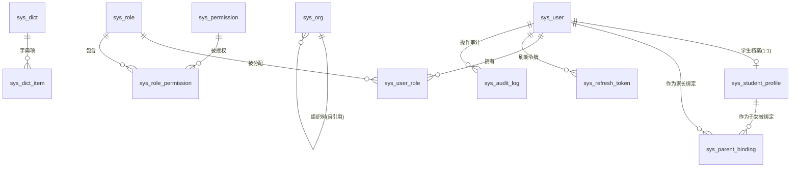
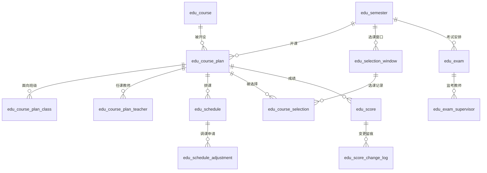
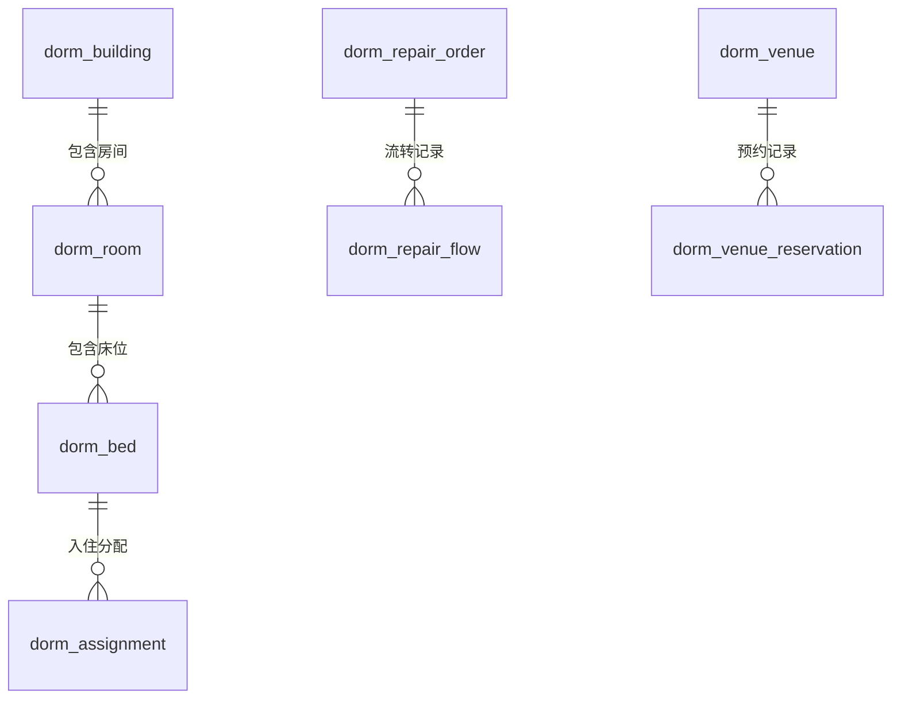
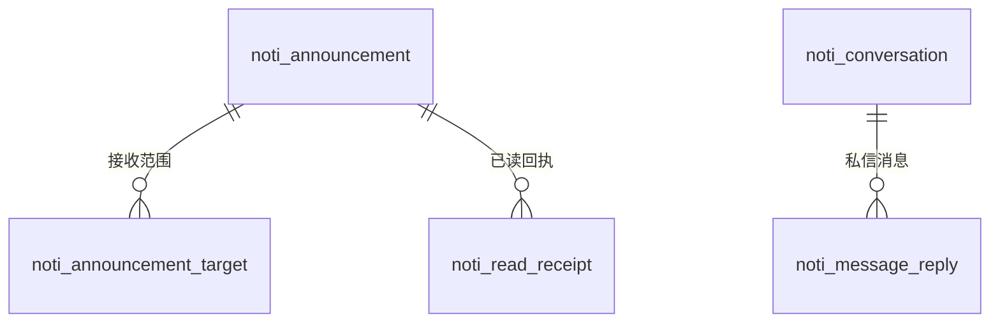
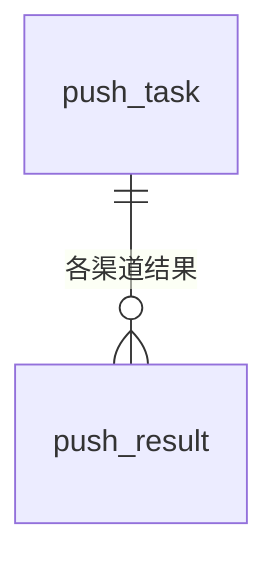

# SmartCampusOS 智慧校园管理系统 — 数据库设计文档（DBD）

## 文档信息

| 项目 | 内容 |
| --- | --- |
| 文档名称 | SmartCampusOS 智慧校园管理系统 数据库设计文档 |
| 版本号 | v1.0 |
| 文档状态 | 草案（待评审） |
| 编写日期 | 2026-08-06 |
| 编写人 | 架构组 / DBA |
| 关联文档 | SmartCampusOS-智慧校园管理系统-PRD v1.0、SmartCampusOS-智慧校园管理系统-LLD v1.0 |
| 适用对象 | 研发、测试、DBA、运维 |

**修订记录**

| 版本 | 日期 | 修订人 | 修订说明 |
| --- | --- | --- | --- |
| v1.0 | 2026-08-06 | 架构组 | 全量表设计与 ER 定稿，待评审 |

> **权威性说明**：本文档为 SmartCampusOS 数据表结构与 ER 关系的**唯一权威来源**。LLD v1.0 不再维护数据表细节，两者冲突时以本文档为准。

---

## 1. 引言

### 1.1 目的

定义全部微服务的数据库表结构、字段、索引与实体关系（ER），作为研发建表、测试造数、DBA 调优与运维备份恢复的实施依据。

### 1.2 范围

覆盖 7 个服务数据库：`identity_db`、`edu_db`、`dorm_db`、`notice_db`、`data_db`、`push_db`、`file_db`（ApiGateway 无状态，不建库）。共 **50 张表**。

### 1.3 关联文档与架构背景

- 服务划分见 LLD §2.3；数据访问层采用 **FreeSql**（LLD §2.4），CodeFirst 结构同步。
- 跨服务禁止跨库 JOIN，通过 ID + 冗余快照 + 领域事件同步（LLD §2.5、§7）。

---

## 2. 设计约定

### 2.1 库与命名

| 库名 | 服务 | 表前缀 |
| --- | --- | --- |
| identity_db | IdentityService | `sys_` |
| edu_db | EduService | `edu_` |
| dorm_db | DormService | `dorm_` |
| notice_db | NoticeService | `noti_` |
| data_db | DataService | `data_` |
| push_db | PushGateway | `push_` |
| file_db | FileService | `file_` |

### 2.2 通用字段（所有表默认包含，后文不再重复列出）

| 字段 | 类型 | 说明 |
| --- | --- | --- |
| id | BIGINT UNSIGNED | 主键，雪花 ID，全局唯一 |
| created_at | DATETIME | 创建时间（UTC 存储，展示层转东八区） |
| updated_at | DATETIME | 最后更新时间 |
| created_by | BIGINT | 创建人（逻辑引用 sys_user.id） |
| updated_by | BIGINT | 最后更新人 |
| is_deleted | TINYINT | 软删除标记：0 否 / 1 是 |

### 2.3 类型规范

| 用途 | 类型 |
| --- | --- |
| 主键/外键 ID | BIGINT UNSIGNED |
| 名称/编码 | VARCHAR(32)~VARCHAR(64) |
| 手机号 | VARCHAR(20) |
| 长文本/富文本 | TEXT / LONGTEXT |
| 结构化数据 | JSON（MySQL 8 原生） |
| 状态/枚举 | TINYINT（0-255，值含义见 §12 数据字典） |
| 金额/统计 | DECIMAL(10,2) / DECIMAL(5,2) |
| 日期/时间 | DATE / DATETIME |
| IP 地址 | VARCHAR(45)（兼容 IPv6） |

### 2.4 索引与约束约定

1. 主键统一 `id`；逻辑外键字段一律建普通索引，**不建物理外键**（跨库/迁移友好）。
2. 唯一约束：编码类字段（学工号、课程编码、角色编码、字典编码）建唯一索引。
3. 高频查询组合索引：状态 + 时间、业务 ID + 状态等（见各表"索引"说明）。
4. JSON 字段不建索引（如确需查询，拆列或建生成列索引，另行评审）。

### 2.5 字符集与引擎

- 库/表统一 `utf8mb4` / `utf8mb4_general_ci`（兼容表情符号与生僻字）。
- 引擎 InnoDB；每服务主库 + 从库（读写分离，LLD §9）。

---

## 3. IdentityService（identity_db）— 12 表

### 3.1 ER 图

### 3.2 表设计

#### sys_user — 账号表

| 字段 | 类型 | 可空 | 默认 | 说明 |
| --- | --- | --- | --- | --- |
| user_no | VARCHAR(32) | 否 | — | 学工号/工号，唯一索引 |
| mobile | VARCHAR(20) | 是 | NULL | 手机号（AES-256 加密存储） |
| password_hash | VARCHAR(128) | 否 | — | 密码加盐哈希 |
| salt | VARCHAR(32) | 否 | — | 密码盐值 |
| user_type | TINYINT | 否 | — | 用户类型：1 学生 / 2 教师 / 3 家长 / 4 职工 |
| real_name | VARCHAR(64) | 否 | — | 真实姓名 |
| avatar_url | VARCHAR(255) | 是 | NULL | 头像 |
| status | TINYINT | 否 | 1 | 状态：1 启用 / 0 禁用 |
| last_login_at | DATETIME | 是 | NULL | 最近登录时间 |

索引：`uk_user_no`(user_no)、`idx_mobile`(mobile)。

#### sys_student_profile — 学生档案表

| 字段 | 类型 | 可空 | 默认 | 说明 |
| --- | --- | --- | --- | --- |
| user_id | BIGINT | 否 | — | 关联 sys_user，唯一 |
| class_id | BIGINT | 否 | — | 当前班级（逻辑引用 sys_org） |
| grade_id | BIGINT | 否 | — | 年级（逻辑引用 sys_org） |
| enroll_date | DATE | 否 | — | 入学日期 |
| status | TINYINT | 否 | 1 | 学籍：1 在读 / 2 休学 / 3 毕业 / 4 退学 |

索引：`uk_user_id`(user_id)、`idx_class_id`(class_id)。

#### sys_parent_binding — 家长子女绑定表

| 字段 | 类型 | 可空 | 默认 | 说明 |
| --- | --- | --- | --- | --- |
| parent_user_id | BIGINT | 否 | — | 家长用户 |
| student_user_id | BIGINT | 否 | — | 子女用户 |
| relation | VARCHAR(16) | 否 | — | 关系：父亲 / 母亲 / 其他 |
| audit_status | TINYINT | 否 | 0 | 审核：0 待审核 / 1 通过 / 2 驳回 |
| audited_by | BIGINT | 是 | NULL | 审核人（班主任） |
| audited_at | DATETIME | 是 | NULL | 审核时间 |

索引：`uk_parent_student`(parent_user_id, student_user_id)、`idx_student`(student_user_id)。

#### sys_org — 组织架构表（自引用树）

| 字段 | 类型 | 可空 | 默认 | 说明 |
| --- | --- | --- | --- | --- |
| parent_id | BIGINT | 是 | NULL | 父组织（根节点为 NULL） |
| org_type | TINYINT | 否 | — | 1 学校 / 2 年级 / 3 班级 / 4 部门 / 5 教研组 |
| name | VARCHAR(64) | 否 | — | 名称 |
| code | VARCHAR(32) | 否 | — | 编码，唯一 |
| sort | INT | 否 | 0 | 排序号 |
| status | TINYINT | 否 | 1 | 1 启用 / 0 停用 |

索引：`uk_code`(code)、`idx_parent`(parent_id)。

#### sys_role — 角色表

| 字段 | 类型 | 可空 | 默认 | 说明 |
| --- | --- | --- | --- | --- |
| code | VARCHAR(32) | 否 | — | 角色编码，唯一（STUDENT/TEACHER/PARENT/DORM_ADMIN/LOGISTICS/SECURITY/LEADER/SYS_ADMIN） |
| name | VARCHAR(64) | 否 | — | 角色名称 |
| data_scope | TINYINT | 否 | 4 | 数据范围：1 全校 / 2 年级 / 3 部门班级 / 4 本人 |
| builtin | TINYINT | 否 | 0 | 是否内置（内置不可删改 code） |
| remark | VARCHAR(255) | 是 | NULL | 备注 |

索引：`uk_code`(code)。

#### sys_permission — 权限点表

| 字段 | 类型 | 可空 | 默认 | 说明 |
| --- | --- | --- | --- | --- |
| code | VARCHAR(64) | 否 | — | 权限编码，唯一（如 edu:schedule:view） |
| name | VARCHAR(64) | 否 | — | 权限名称 |
| module | VARCHAR(32) | 否 | — | 所属模块（edu/dorm/noti/data/identity） |
| type | TINYINT | 否 | 2 | 1 菜单 / 2 接口 |

索引：`uk_code`(code)。

#### sys_user_role — 用户角色关联表

| 字段 | 类型 | 可空 | 默认 | 说明 |
| --- | --- | --- | --- | --- |
| user_id | BIGINT | 否 | — | 用户 |
| role_id | BIGINT | 否 | — | 角色（支持一用户多角色） |

索引：`uk_user_role`(user_id, role_id)、`idx_role`(role_id)。

#### sys_role_permission — 角色权限关联表

| 字段 | 类型 | 可空 | 默认 | 说明 |
| --- | --- | --- | --- | --- |
| role_id | BIGINT | 否 | — | 角色 |
| permission_id | BIGINT | 否 | — | 权限点 |

索引：`uk_role_perm`(role_id, permission_id)。

#### sys_refresh_token — 刷新令牌表

| 字段 | 类型 | 可空 | 默认 | 说明 |
| --- | --- | --- | --- | --- |
| user_id | BIGINT | 否 | — | 用户 |
| token_hash | VARCHAR(128) | 否 | — | 令牌哈希（不存明文） |
| expires_at | DATETIME | 否 | — | 过期时间 |
| revoked | TINYINT | 否 | 0 | 是否已吊销 |

索引：`idx_user`(user_id)、`idx_expires`(expires_at)。

#### sys_audit_log — 操作审计日志表

| 字段 | 类型 | 可空 | 默认 | 说明 |
| --- | --- | --- | --- | --- |
| user_id | BIGINT | 否 | — | 操作人 |
| action | VARCHAR(64) | 否 | — | 操作动作（login/approve/score_change 等） |
| target_type | VARCHAR(32) | 是 | NULL | 目标类型（announcement/score/...） |
| target_id | BIGINT | 是 | NULL | 目标 ID |
| detail | JSON | 是 | NULL | 操作详情（变更前后值等） |
| ip | VARCHAR(45) | 是 | NULL | 来源 IP |
| user_agent | VARCHAR(255) | 是 | NULL | UA |

索引：`idx_user_time`(user_id, created_at)、`idx_action_time`(action, created_at)。

#### sys_dict / sys_dict_item — 数据字典表

**sys_dict**

| 字段 | 类型 | 可空 | 默认 | 说明 |
| --- | --- | --- | --- | --- |
| code | VARCHAR(64) | 否 | — | 字典编码，唯一（如 repair_category、org_type） |
| name | VARCHAR(64) | 否 | — | 字典名称 |
| remark | VARCHAR(255) | 是 | NULL | 备注 |

**sys_dict_item**

| 字段 | 类型 | 可空 | 默认 | 说明 |
| --- | --- | --- | --- | --- |
| dict_code | VARCHAR(64) | 否 | — | 所属字典 |
| item_code | VARCHAR(64) | 否 | — | 项编码（TINYINT 状态值映射） |
| item_name | VARCHAR(64) | 否 | — | 项名称 |
| sort | INT | 否 | 0 | 排序 |
| status | TINYINT | 否 | 1 | 1 启用 / 0 停用 |

索引：`uk_dict_item`(dict_code, item_code)。

---

## 4. EduService（edu_db）— 14 表

### 4.1 ER 图

> 学生/教师等人员 ID 逻辑引用 identity_db.sys_user，不建物理外键。

### 4.2 表设计

#### edu_semester — 学期表

| 字段 | 类型 | 可空 | 默认 | 说明 |
| --- | --- | --- | --- | --- |
| name | VARCHAR(32) | 否 | — | 学期名称（如 2026-2027-1） |
| school_year | VARCHAR(16) | 否 | — | 学年（如 2026-2027） |
| term | TINYINT | 否 | — | 学期：1 第一学期 / 2 第二学期 |
| start_date | DATE | 否 | — | 开始日期 |
| end_date | DATE | 否 | — | 结束日期 |
| week_count | TINYINT | 否 | — | 教学周数 |
| current_week | TINYINT | 否 | 1 | 当前教学周（校历基准） |
| status | TINYINT | 否 | 0 | 0 未开始 / 1 进行中 / 2 已结束 |

#### edu_course — 课程表

| 字段 | 类型 | 可空 | 默认 | 说明 |
| --- | --- | --- | --- | --- |
| code | VARCHAR(32) | 否 | — | 课程编码，唯一 |
| name | VARCHAR(64) | 否 | — | 课程名称 |
| credit | DECIMAL(3,1) | 否 | 0 | 学分 |
| course_type | TINYINT | 否 | — | 1 必修 / 2 选修 / 3 实践 |
| total_hours | INT | 否 | 0 | 总学时 |
| description | TEXT | 是 | NULL | 课程说明 |

索引：`uk_code`(code)。

#### edu_course_plan — 开课计划表

| 字段 | 类型 | 可空 | 默认 | 说明 |
| --- | --- | --- | --- | --- |
| course_id | BIGINT | 否 | — | 课程 |
| semester_id | BIGINT | 否 | — | 学期 |
| capacity | INT | 否 | 0 | 选课容量 |
| status | TINYINT | 否 | 0 | 0 草稿 / 1 已发布 / 2 已关闭 |
| remark | VARCHAR(255) | 是 | NULL | 备注 |

索引：`idx_semester_course`(semester_id, course_id)。

#### edu_course_plan_class — 开课班级关联表

| 字段 | 类型 | 可空 | 默认 | 说明 |
| --- | --- | --- | --- | --- |
| plan_id | BIGINT | 否 | — | 开课计划 |
| class_id | BIGINT | 否 | — | 班级（sys_org） |

索引：`uk_plan_class`(plan_id, class_id)、`idx_class`(class_id)。

#### edu_course_plan_teacher — 任课教师关联表

| 字段 | 类型 | 可空 | 默认 | 说明 |
| --- | --- | --- | --- | --- |
| plan_id | BIGINT | 否 | — | 开课计划 |
| teacher_id | BIGINT | 否 | — | 教师（sys_user） |
| is_primary | TINYINT | 否 | 0 | 是否主讲：1 是 / 0 助教 |

索引：`uk_plan_teacher`(plan_id, teacher_id)。

#### edu_schedule — 课表记录表

| 字段 | 类型 | 可空 | 默认 | 说明 |
| --- | --- | --- | --- | --- |
| semester_id | BIGINT | 否 | — | 学期 |
| course_plan_id | BIGINT | 否 | — | 开课计划 |
| class_id | BIGINT | 否 | — | 上课班级 |
| teacher_id | BIGINT | 否 | — | 上课教师 |
| room_id | BIGINT | 是 | NULL | 教室（dorm_venue 或独立教室表） |
| weekday | TINYINT | 否 | — | 星期：1-7 |
| week_list | JSON | 否 | — | 教学周列表，如 [1,2,3,5] |
| period_start | TINYINT | 否 | — | 起始节次 |
| period_end | TINYINT | 否 | — | 结束节次 |

索引：`idx_class`(class_id, weekday)、`idx_teacher`(teacher_id, weekday)、`idx_room`(room_id, weekday)。

#### edu_schedule_adjustment — 调课申请表

| 字段 | 类型 | 可空 | 默认 | 说明 |
| --- | --- | --- | --- | --- |
| schedule_id | BIGINT | 否 | — | 原课表记录 |
| apply_user_id | BIGINT | 否 | — | 申请人（教师） |
| old_value | JSON | 否 | — | 原时间/教室 |
| new_value | JSON | 否 | — | 新时间/教室 |
| reason | VARCHAR(255) | 否 | — | 调课原因 |
| status | TINYINT | 否 | 0 | 0 待审批 / 1 通过 / 2 驳回 |
| audited_by | BIGINT | 是 | NULL | 审批人（教务） |
| audited_at | DATETIME | 是 | NULL | 审批时间 |

索引：`idx_schedule`(schedule_id)、`idx_status`(status, created_at)。

#### edu_selection_window — 选课窗口表

| 字段 | 类型 | 可空 | 默认 | 说明 |
| --- | --- | --- | --- | --- |
| semester_id | BIGINT | 否 | — | 学期 |
| scope | JSON | 否 | — | 适用年级/班级范围 |
| credit_limit | DECIMAL(4,1) | 否 | 0 | 每人学分上限 |
| strategy | TINYINT | 否 | 1 | 1 先到先得 / 2 志愿抽签 |
| start_at | DATETIME | 否 | — | 开始时间 |
| end_at | DATETIME | 否 | — | 截止时间 |
| status | TINYINT | 否 | 0 | 0 未开始 / 1 进行中 / 2 已结束 |

索引：`idx_semester`(semester_id)。

#### edu_course_selection — 选课记录表

| 字段 | 类型 | 可空 | 默认 | 说明 |
| --- | --- | --- | --- | --- |
| selection_window_id | BIGINT | 否 | — | 选课窗口 |
| student_user_id | BIGINT | 否 | — | 学生 |
| course_plan_id | BIGINT | 否 | — | 开课计划 |
| status | TINYINT | 否 | 1 | 1 已选 / 2 已退选 / 3 抽签中 |
| lottery_result | TINYINT | 是 | NULL | 抽签结果：1 中签 / 0 未中 |
| selected_at | DATETIME | 否 | — | 选课时间 |

索引：`uk_window_student_plan`(selection_window_id, student_user_id, course_plan_id)、`idx_plan`(course_plan_id)。

#### edu_score — 成绩表

| 字段 | 类型 | 可空 | 默认 | 说明 |
| --- | --- | --- | --- | --- |
| course_plan_id | BIGINT | 否 | — | 开课计划 |
| student_user_id | BIGINT | 否 | — | 学生 |
| score_value | DECIMAL(5,2) | 是 | NULL | 百分制成绩（等级制时为空） |
| grade_level | VARCHAR(8) | 是 | NULL | 等级制成绩（优/良/及格/不及格） |
| status | TINYINT | 否 | 0 | 0 草稿 / 1 已提交 / 2 已锁定 |
| submitted_by | BIGINT | 否 | — | 录入教师 |

索引：`uk_plan_student`(course_plan_id, student_user_id)。

#### edu_score_change_log — 成绩变更日志表

| 字段 | 类型 | 可空 | 默认 | 说明 |
| --- | --- | --- | --- | --- |
| score_id | BIGINT | 否 | — | 成绩 |
| old_value | JSON | 否 | — | 原值 |
| new_value | JSON | 否 | — | 新值 |
| reason | VARCHAR(255) | 否 | — | 修改原因 |
| status | TINYINT | 否 | 0 | 0 待审批 / 1 通过 / 2 驳回 |
| applied_by | BIGINT | 否 | — | 申请人 |

索引：`idx_score`(score_id)。

#### edu_exam — 考试安排表

| 字段 | 类型 | 可空 | 默认 | 说明 |
| --- | --- | --- | --- | --- |
| semester_id | BIGINT | 否 | — | 学期 |
| course_id | BIGINT | 否 | — | 课程 |
| exam_date | DATE | 否 | — | 考试日期 |
| start_time | TIME | 否 | — | 开始时间 |
| end_time | TIME | 否 | — | 结束时间 |
| room_id | BIGINT | 否 | — | 考场（逻辑引用场地） |

索引：`idx_semester`(semester_id, exam_date)。

#### edu_exam_supervisor — 监考教师关联表

| 字段 | 类型 | 可空 | 默认 | 说明 |
| --- | --- | --- | --- | --- |
| exam_id | BIGINT | 否 | — | 考试安排 |
| teacher_id | BIGINT | 否 | — | 监考教师 |

索引：`uk_exam_teacher`(exam_id, teacher_id)。

#### edu_transfer_record — 学籍异动记录表

| 字段 | 类型 | 可空 | 默认 | 说明 |
| --- | --- | --- | --- | --- |
| student_user_id | BIGINT | 否 | — | 学生 |
| type | TINYINT | 否 | — | 1 转班 / 2 休学 / 3 复学 / 4 退学 |
| from_class_id | BIGINT | 是 | NULL | 原班级 |
| to_class_id | BIGINT | 是 | NULL | 新班级 |
| reason | VARCHAR(255) | 是 | NULL | 原因 |
| status | TINYINT | 否 | 0 | 0 待审批 / 1 生效 / 2 驳回 |
| applied_at | DATETIME | 否 | — | 申请时间 |

索引：`idx_student`(student_user_id)。

---

## 5. DormService（dorm_db）— 10 表

### 5.1 ER 图

> 报修人、申请人等人员 ID 逻辑引用 identity_db.sys_user。

### 5.2 表设计

#### dorm_building — 楼栋表

| 字段 | 类型 | 可空 | 默认 | 说明 |
| --- | --- | --- | --- | --- |
| name | VARCHAR(64) | 否 | — | 楼栋名称 |
| code | VARCHAR(32) | 否 | — | 楼栋编码，唯一 |
| floors | TINYINT | 否 | — | 楼层数 |
| campus_area | VARCHAR(32) | 是 | NULL | 校区/区域 |

索引：`uk_code`(code)。

#### dorm_room — 房间表

| 字段 | 类型 | 可空 | 默认 | 说明 |
| --- | --- | --- | --- | --- |
| building_id | BIGINT | 否 | — | 楼栋 |
| floor | TINYINT | 否 | — | 楼层 |
| room_no | VARCHAR(16) | 否 | — | 房间号 |
| room_type | TINYINT | 否 | — | 1 四人间 / 2 六人间 / 3 八人间 / 4 其他 |
| capacity | TINYINT | 否 | — | 床位容量 |
| status | TINYINT | 否 | 1 | 1 正常 / 2 维修中 / 3 停用 |

索引：`uk_building_room`(building_id, room_no)。

#### dorm_bed — 床位表

| 字段 | 类型 | 可空 | 默认 | 说明 |
| --- | --- | --- | --- | --- |
| room_id | BIGINT | 否 | — | 房间 |
| bed_no | VARCHAR(8) | 否 | — | 床位号 |
| status | TINYINT | 否 | 0 | 0 空闲 / 1 已入住 / 2 维修中 / 3 停用 |

索引：`uk_room_bed`(room_id, bed_no)。

#### dorm_assignment — 入住分配表

| 字段 | 类型 | 可空 | 默认 | 说明 |
| --- | --- | --- | --- | --- |
| student_user_id | BIGINT | 否 | — | 学生 |
| bed_id | BIGINT | 否 | — | 床位 |
| type | TINYINT | 否 | — | 1 入住 / 2 调宿 / 3 退宿 |
| status | TINYINT | 否 | 0 | 0 待审批 / 1 生效 / 2 驳回 |
| approved_by | BIGINT | 是 | NULL | 审批人（宿管） |
| assigned_at | DATETIME | 否 | — | 分配时间 |

索引：`idx_student`(student_user_id)、`idx_bed`(bed_id, status)。

#### dorm_repair_order — 报修工单表

| 字段 | 类型 | 可空 | 默认 | 说明 |
| --- | --- | --- | --- | --- |
| order_no | VARCHAR(32) | 否 | — | 工单号，唯一 |
| reporter_user_id | BIGINT | 否 | — | 报修人 |
| location_type | TINYINT | 否 | — | 1 宿舍 / 2 教室 / 3 公共区域 |
| location_id | BIGINT | 否 | — | 位置 ID（宿舍/教室/区域） |
| category | VARCHAR(32) | 否 | — | 类别（字典 repair_category：水电/门窗/网络/设备） |
| urgency | TINYINT | 否 | 0 | 0 一般 / 1 紧急 |
| description | TEXT | 否 | — | 问题描述 |
| status | TINYINT | 否 | 0 | 0 待派单 / 1 已派单 / 2 处理中 / 3 待验收 / 4 已完成 / 5 已关闭 |
| sla_deadline | DATETIME | 是 | NULL | SLA 截止时间 |

索引：`uk_order_no`(order_no)、`idx_status`(status, created_at)、`idx_reporter`(reporter_user_id)。

#### dorm_repair_flow — 工单流转记录表

| 字段 | 类型 | 可空 | 默认 | 说明 |
| --- | --- | --- | --- | --- |
| order_id | BIGINT | 否 | — | 工单 |
| action | TINYINT | 否 | — | 1 派单 / 2 接单 / 3 处理 / 4 验收 / 5 评价 |
| operator_id | BIGINT | 否 | — | 操作人 |
| comment | VARCHAR(500) | 是 | NULL | 说明/评价 |
| images | JSON | 是 | NULL | 图片 storage_key 数组 |

索引：`idx_order`(order_id, created_at)。

#### dorm_venue — 场地表

| 字段 | 类型 | 可空 | 默认 | 说明 |
| --- | --- | --- | --- | --- |
| name | VARCHAR(64) | 否 | — | 场地名称 |
| venue_type | TINYINT | 否 | — | 1 教室 / 2 会议室 / 3 体育馆 / 4 其他 |
| location | VARCHAR(128) | 是 | NULL | 位置 |
| capacity | INT | 否 | 0 | 容纳人数 |
| open_periods | JSON | 否 | — | 可约时段配置 |
| manager_role | VARCHAR(32) | 否 | — | 审批角色编码 |
| status | TINYINT | 否 | 1 | 1 可约 / 0 停用 |

#### dorm_venue_reservation — 场地预约表

| 字段 | 类型 | 可空 | 默认 | 说明 |
| --- | --- | --- | --- | --- |
| venue_id | BIGINT | 否 | — | 场地 |
| applicant_user_id | BIGINT | 否 | — | 申请人 |
| reserve_date | DATE | 否 | — | 预约日期 |
| period_start | TINYINT | 否 | — | 开始节次/时段 |
| period_end | TINYINT | 否 | — | 结束节次/时段 |
| purpose | VARCHAR(255) | 否 | — | 用途 |
| status | TINYINT | 否 | 0 | 0 待审批 / 1 通过 / 2 驳回 / 3 已使用 / 4 爽约 |
| no_show_count | INT | 否 | 0 | 累计爽约次数（冗余） |

索引：`uk_venue_time`(venue_id, reserve_date, period_start, period_end)、`idx_applicant`(applicant_user_id)。

#### dorm_meter_reading — 水电抄表记录表

| 字段 | 类型 | 可空 | 默认 | 说明 |
| --- | --- | --- | --- | --- |
| room_id | BIGINT | 否 | — | 房间 |
| meter_type | TINYINT | 否 | — | 1 水 / 2 电 |
| reading_value | DECIMAL(10,2) | 否 | — | 读数 |
| reading_date | DATE | 否 | — | 抄表日期 |
| record_user_id | BIGINT | 否 | — | 抄表人 |
| abnormal | TINYINT | 否 | 0 | 是否异常：0 否 / 1 是 |

索引：`idx_room_date`(room_id, reading_date)。

#### dorm_inspection_task — 设施巡检任务表

| 字段 | 类型 | 可空 | 默认 | 说明 |
| --- | --- | --- | --- | --- |
| room_id | BIGINT | 是 | NULL | 巡检对象（房间，可空表示公共区域） |
| task_date | DATE | 否 | — | 巡检日期 |
| inspect_user_id | BIGINT | 否 | — | 巡检人 |
| result | JSON | 否 | — | 巡检项结果 |
| abnormal_flag | TINYINT | 否 | 0 | 是否异常：0 否 / 1 是 |
| status | TINYINT | 否 | 0 | 0 待巡检 / 1 已完成 |

索引：`idx_date`(task_date, status)。

---

## 6. NoticeService（notice_db）— 8 表

### 6.1 ER 图

> `noti_message`（站内消息）、`noti_child_digest`（家长子女摘要）为独立面向用户/聚合表，无强关联。

### 6.2 表设计

#### noti_announcement — 公告表

| 字段 | 类型 | 可空 | 默认 | 说明 |
| --- | --- | --- | --- | --- |
| title | VARCHAR(128) | 否 | — | 标题 |
| content | LONGTEXT | 否 | — | 正文（富文本） |
| priority | TINYINT | 否 | 0 | 0 普通 / 1 重要 / 2 紧急 |
| send_type | TINYINT | 否 | 0 | 0 立即 / 1 定时 |
| send_at | DATETIME | 是 | NULL | 定时发送时间 |
| need_receipt | TINYINT | 否 | 0 | 是否需回执：0 否 / 1 是 |
| top_flag | TINYINT | 否 | 0 | 是否置顶 |
| status | TINYINT | 否 | 0 | 0 草稿 / 1 已发布 / 2 已下线 |

索引：`idx_status_time`(status, created_at)。

#### noti_announcement_target — 公告范围表

| 字段 | 类型 | 可空 | 默认 | 说明 |
| --- | --- | --- | --- | --- |
| announcement_id | BIGINT | 否 | — | 公告 |
| target_type | TINYINT | 否 | — | 1 组织 / 2 角色 / 3 班级 / 4 标签 |
| target_id | BIGINT | 否 | — | 目标 ID（冗余目标名称快照于 extra） |
| extra | JSON | 是 | NULL | 冗余快照（如目标名称） |

索引：`idx_announcement`(announcement_id)。

#### noti_read_receipt — 已读回执表

| 字段 | 类型 | 可空 | 默认 | 说明 |
| --- | --- | --- | --- | --- |
| announcement_id | BIGINT | 否 | — | 公告 |
| user_id | BIGINT | 否 | — | 接收人 |
| read_at | DATETIME | 是 | NULL | 已读时间（NULL 表示未读） |

索引：`uk_ann_user`(announcement_id, user_id)。

#### noti_message — 站内消息表

| 字段 | 类型 | 可空 | 默认 | 说明 |
| --- | --- | --- | --- | --- |
| user_id | BIGINT | 否 | — | 接收人 |
| message_type | TINYINT | 否 | — | 1 公告 / 2 业务通知 / 3 系统消息 |
| title | VARCHAR(128) | 否 | — | 标题 |
| content | TEXT | 否 | — | 内容 |
| biz_type | VARCHAR(32) | 是 | NULL | 业务类型（schedule/repair/selection 等） |
| biz_id | BIGINT | 是 | NULL | 业务单据 ID |
| read_flag | TINYINT | 否 | 0 | 0 未读 / 1 已读 |

索引：`idx_user_read`(user_id, read_flag, created_at)。

#### noti_conversation — 家校会话表

| 字段 | 类型 | 可空 | 默认 | 说明 |
| --- | --- | --- | --- | --- |
| parent_user_id | BIGINT | 否 | — | 家长 |
| teacher_user_id | BIGINT | 否 | — | 教师（班主任/任课） |
| class_id | BIGINT | 否 | — | 关联班级 |
| last_message_at | DATETIME | 是 | NULL | 最后消息时间 |
| status | TINYINT | 否 | 1 | 1 正常 / 0 关闭 |

索引：`uk_pair`(parent_user_id, teacher_user_id)。

#### noti_message_reply — 私信回复表

| 字段 | 类型 | 可空 | 默认 | 说明 |
| --- | --- | --- | --- | --- |
| conversation_id | BIGINT | 否 | — | 会话 |
| sender_user_id | BIGINT | 否 | — | 发送人 |
| content | VARCHAR(1000) | 否 | — | 内容 |
| audit_flag | TINYINT | 否 | 0 | 敏感词命中：0 正常 / 1 待复核 |

索引：`idx_conversation`(conversation_id, created_at)。

#### noti_subscription — 消息订阅设置表

| 字段 | 类型 | 可空 | 默认 | 说明 |
| --- | --- | --- | --- | --- |
| user_id | BIGINT | 否 | — | 用户，唯一 |
| channel_mask | INT | 否 | 3 | 渠道位掩码：1 站内信 / 2 App / 4 短信 / 8 微信 |
| quiet_period | JSON | 是 | NULL | 免打扰时段 |

索引：`uk_user`(user_id)。

#### noti_child_digest — 家长子女摘要表（只读聚合）

| 字段 | 类型 | 可空 | 默认 | 说明 |
| --- | --- | --- | --- | --- |
| student_user_id | BIGINT | 否 | — | 子女，唯一 |
| digest_json | JSON | 否 | — | 成绩/考勤/消费摘要快照 |
| updated_at | DATETIME | 否 | — | 摘要更新时间（事件驱动刷新） |

索引：`uk_student`(student_user_id)。

---

## 7. DataService（data_db）— 3 表

### 7.1 ER 图

三张表相互独立（指标快照、看板配置、报表模板），无物理关联，通过编码/类型逻辑组织。

### 7.2 表设计

#### data_metric_snapshot — 指标快照表

| 字段 | 类型 | 可空 | 默认 | 说明 |
| --- | --- | --- | --- | --- |
| metric_code | VARCHAR(64) | 否 | — | 指标编码（attendance_rate/repair_open 等） |
| biz_date | DATE | 否 | — | 业务日期 |
| scope_type | TINYINT | 否 | 0 | 0 全校 / 1 年级 / 2 部门 |
| scope_id | BIGINT | 否 | 0 | 范围 ID（0 表示全校） |
| value | DECIMAL(14,4) | 否 | — | 指标值 |
| extra_json | JSON | 是 | NULL | 扩展（明细摘要等） |

索引：`uk_metric_date_scope`(metric_code, biz_date, scope_type, scope_id)。

#### data_dashboard_config — 看板配置表

| 字段 | 类型 | 可空 | 默认 | 说明 |
| --- | --- | --- | --- | --- |
| type | TINYINT | 否 | — | 1 管理驾驶舱 / 2 数据大屏 |
| config_json | JSON | 否 | — | 看板布局/指标配置 |
| owner_user_id | BIGINT | 是 | NULL | 创建人 |
| status | TINYINT | 否 | 1 | 1 启用 / 0 停用 |

#### data_report_template — 报表模板表

| 字段 | 类型 | 可空 | 默认 | 说明 |
| --- | --- | --- | --- | --- |
| code | VARCHAR(64) | 否 | — | 模板编码，唯一 |
| name | VARCHAR(64) | 否 | — | 模板名称 |
| source | VARCHAR(128) | 否 | — | 数据源标识 |
| params_json | JSON | 是 | NULL | 参数定义 |
| status | TINYINT | 否 | 1 | 1 启用 / 0 停用 |

索引：`uk_code`(code)。

---

## 8. PushGateway（push_db）— 2 表

### 8.1 ER 图

### 8.2 表设计

#### push_task — 推送任务表

| 字段 | 类型 | 可空 | 默认 | 说明 |
| --- | --- | --- | --- | --- |
| biz_type | VARCHAR(32) | 否 | — | 业务类型（announcement/message/approval） |
| template_code | VARCHAR(64) | 否 | — | 模板编码 |
| target_json | JSON | 否 | — | 目标用户列表 |
| channel_mask | INT | 否 | — | 渠道位掩码 |
| status | TINYINT | 否 | 0 | 0 待发送 / 1 发送中 / 2 部分成功 / 3 完成 / 4 失败 |
| retry_count | INT | 否 | 0 | 已重试次数 |

索引：`idx_status`(status, created_at)。

#### push_result — 渠道发送结果表

| 字段 | 类型 | 可空 | 默认 | 说明 |
| --- | --- | --- | --- | --- |
| task_id | BIGINT | 否 | — | 推送任务 |
| channel | TINYINT | 否 | — | 1 站内信 / 2 App / 3 短信 / 4 微信 |
| status | TINYINT | 否 | — | 0 成功 / 1 失败 / 2 重试中 |
| error_msg | VARCHAR(255) | 是 | NULL | 失败原因 |
| cost_amount | DECIMAL(10,2) | 是 | NULL | 渠道成本（短信计费） |

索引：`idx_task`(task_id)。

---

## 9. FileService（file_db）— 1 表

### 9.1 表设计

#### file_object — 文件元数据表

| 字段 | 类型 | 可空 | 默认 | 说明 |
| --- | --- | --- | --- | --- |
| biz_type | VARCHAR(32) | 否 | — | 业务类型（repair/avatar/announcement 等） |
| biz_id | BIGINT | 是 | NULL | 业务单据 ID |
| file_name | VARCHAR(255) | 否 | — | 原始文件名 |
| storage_key | VARCHAR(255) | 否 | — | 对象存储 Key，唯一 |
| size | BIGINT | 否 | 0 | 文件大小（字节） |
| mime_type | VARCHAR(64) | 是 | NULL | MIME 类型 |
| watermark_flag | TINYINT | 否 | 0 | 是否水印：0 否 / 1 是 |

索引：`uk_storage_key`(storage_key)、`idx_biz`(biz_type, biz_id)。

---

## 10. 跨服务数据引用与一致性约定

1. **不跨库 JOIN**：跨服务引用一律存 ID + 必要冗余快照（如公告冗余目标组织名、工单冗余报修人姓名），避免实时跨库查询。
2. **家长「子女在校一览」**：由 NoticeService 通过领域事件（`ScorePublished` 等）维护只读聚合表 `noti_child_digest`（事件来源见 LLD §7），不实时读取 edu_db。
3. **数据字典全局统一**：`sys_dict` / `sys_dict_item` 由 IdentityService 维护，其他服务启动时缓存本地副本（Redis，见 LLD §9）。
4. **人员 ID 跨服务**：学生/教师/家长 ID 统一为 `sys_user.id`（雪花），各业务表仅存 ID 不建物理外键；身份证号、手机号等敏感字段在 identity_db 加密存储，业务库不冗余敏感信息。
5. **一致性策略**：强一致场景（选课名额、排课冲突）走同步接口 + 事务；跨服务最终一致走领域事件，消费幂等（`EventId` 去重）。

---

## 11. 索引与性能要点

| 场景 | 策略 |
| --- | --- |
| 选课峰值 | `edu_course_selection` 唯一索引防重复；名额扣减走 Redis Lua，落库异步 |
| 消息中心 | `noti_message` 按 (user_id, read_flag, created_at) 组合索引，支持分页拉取 |
| 工单 SLA | `dorm_repair_order` 按 (status, created_at) 索引支撑超时扫描任务 |
| 驾驶舱/大屏 | `data_metric_snapshot` 按 (metric_code, biz_date, scope) 预聚合，避免实时扫业务表 |
| 审计检索 | `sys_audit_log` 按 (user_id/action, created_at) 索引；超期数据归档 |

---

## 12. 数据字典（状态/枚举值汇总）

| 字典编码 | 取值（item_code → 含义） |
| --- | --- |
| user_type | 1 学生 / 2 教师 / 3 家长 / 4 职工 |
| status_enable | 1 启用 / 0 禁用 |
| data_scope | 1 全校 / 2 年级 / 3 部门班级 / 4 本人 |
| org_type | 1 学校 / 2 年级 / 3 班级 / 4 部门 / 5 教研组 |
| student_status | 1 在读 / 2 休学 / 3 毕业 / 4 退学 |
| course_type | 1 必修 / 2 选修 / 3 实践 |
| selection_strategy | 1 先到先得 / 2 志愿抽签 |
| score_status | 0 草稿 / 1 已提交 / 2 已锁定 |
| dorm_room_type | 1 四人间 / 2 六人间 / 3 八人间 / 4 其他 |
| bed_status | 0 空闲 / 1 已入住 / 2 维修中 / 3 停用 |
| repair_category | 水电 / 门窗 / 网络 / 设备 / 其他 |
| repair_urgency | 0 一般 / 1 紧急 |
| repair_status | 0 待派单 / 1 已派单 / 2 处理中 / 3 待验收 / 4 已完成 / 5 已关闭 |
| venue_type | 1 教室 / 2 会议室 / 3 体育馆 / 4 其他 |
| reservation_status | 0 待审批 / 1 通过 / 2 驳回 / 3 已使用 / 4 爽约 |
| announcement_priority | 0 普通 / 1 重要 / 2 紧急 |
| message_type | 1 公告 / 2 业务通知 / 3 系统消息 |
| push_channel | 1 站内信 / 2 App / 3 短信 / 4 微信 |
| push_task_status | 0 待发送 / 1 发送中 / 2 部分成功 / 3 完成 / 4 失败 |

> 全部字典项以 `sys_dict_item` 数据为准，此处为设计期汇总。

---

## 13. 变更管理

1. **建表/变更**：FreeSql CodeFirst 结构同步（LLD §10.4），同步脚本随服务发布；结构变更仅追加、不删列，保证向前兼容。
2. **版本对齐**：数据库变更与 LLD §2.6.7 中央包管理同步评审；破坏性变更须经 DBA 评审并出具回滚脚本。
3. **数据留存**：审计日志 ≥ 3 年、成绩与学籍长期留存（BR-08）；用户注销后按合规要求删除或匿名化。

---

## 附录：表总览（50 表）

| 库 | 表 |
| --- | --- |
| identity_db（12） | sys_user、sys_student_profile、sys_parent_binding、sys_org、sys_role、sys_permission、sys_user_role、sys_role_permission、sys_refresh_token、sys_audit_log、sys_dict、sys_dict_item |
| edu_db（14） | edu_semester、edu_course、edu_course_plan、edu_course_plan_class、edu_course_plan_teacher、edu_schedule、edu_schedule_adjustment、edu_selection_window、edu_course_selection、edu_score、edu_score_change_log、edu_exam、edu_exam_supervisor、edu_transfer_record |
| dorm_db（10） | dorm_building、dorm_room、dorm_bed、dorm_assignment、dorm_repair_order、dorm_repair_flow、dorm_venue、dorm_venue_reservation、dorm_meter_reading、dorm_inspection_task |
| notice_db（8） | noti_announcement、noti_announcement_target、noti_read_receipt、noti_message、noti_conversation、noti_message_reply、noti_subscription、noti_child_digest |
| data_db（3） | data_metric_snapshot、data_dashboard_config、data_report_template |
| push_db（2） | push_task、push_result |
| file_db（1） | file_object |

---

*本文档为 SmartCampusOS 数据库设计基线，变更须经 DBA/架构评审并更新修订记录；建表脚本由 FreeSql CodeFirst 生成，不另行维护手工 DDL。*
